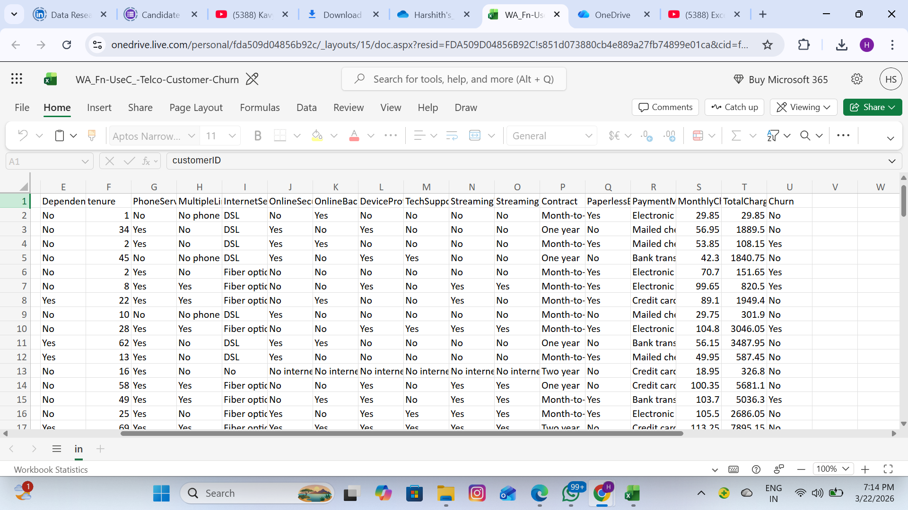

# 📊 FUTURE_DS_02 - Customer Churn Analysis

## 🎯 Objective
Analyze customer churn behavior and identify key factors affecting retention using Excel and Python.

## 🛠 Tools Used
- Excel
- Python (Pandas, Matplotlib)

## 📈 Steps Performed
- Cleaned dataset and handled missing values
- Created derived columns: Churn_Flag, Tenure_Group, Revenue_Group
- Built KPIs such as Total Customers, Churned Customers, Churn Rate, and Retention Rate
- Performed pivot analysis and chart creation in Excel
- Validated analysis using Python
- Generated visual insights to identify churn patterns

## 📊 Key Insights
- Month-to-month customers contribute the highest churn
- Customers with 0–12 months tenure show maximum churn
- Electronic payment users have higher churn
- Pricing impacts customer retention

## 📷 Project Screenshots

### Harshith's_churn Output

### Raw data Output

### Harshith_pythonchurn Output

## 🧠 Conclusion
Customer churn is mainly driven by short-term contracts and early-stage customers. Improving onboarding and encouraging long-term plans can improve retention.

## 🚀 Submission
This repository was created for Future Interns Task 2: FUTURE_DS_02.
